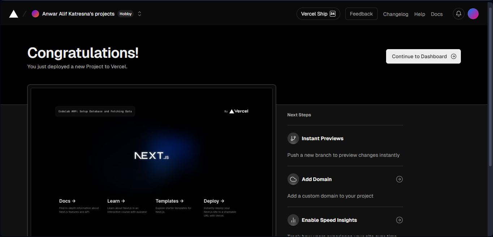
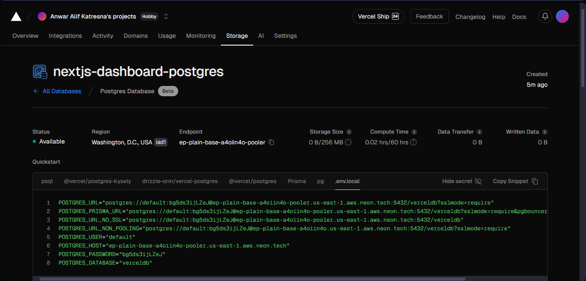
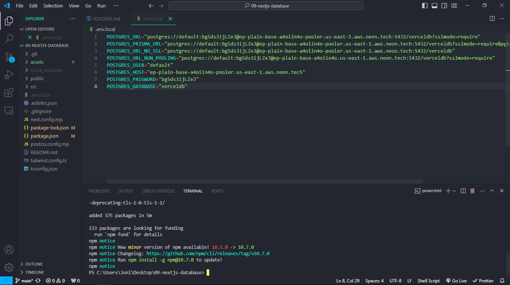
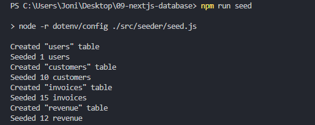
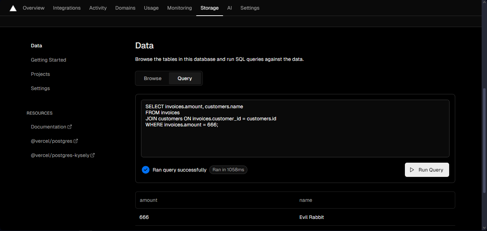
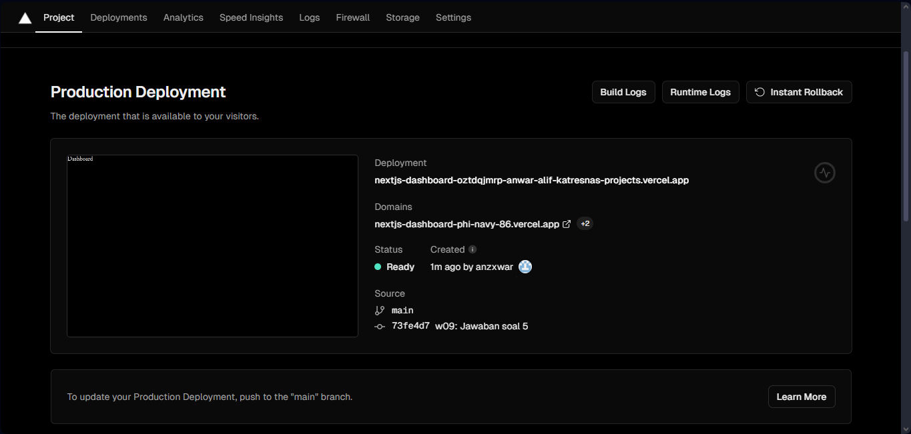
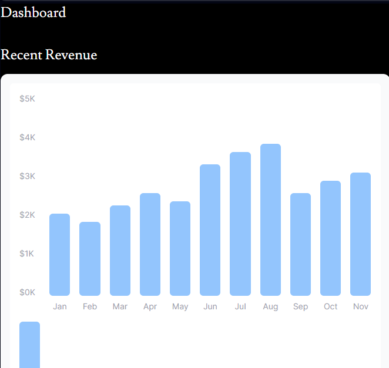
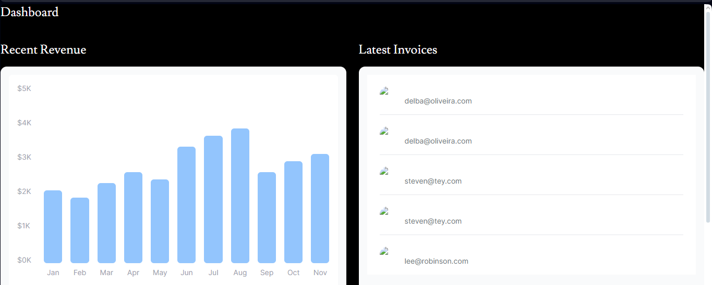
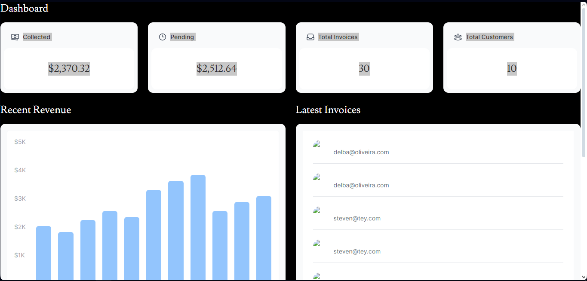
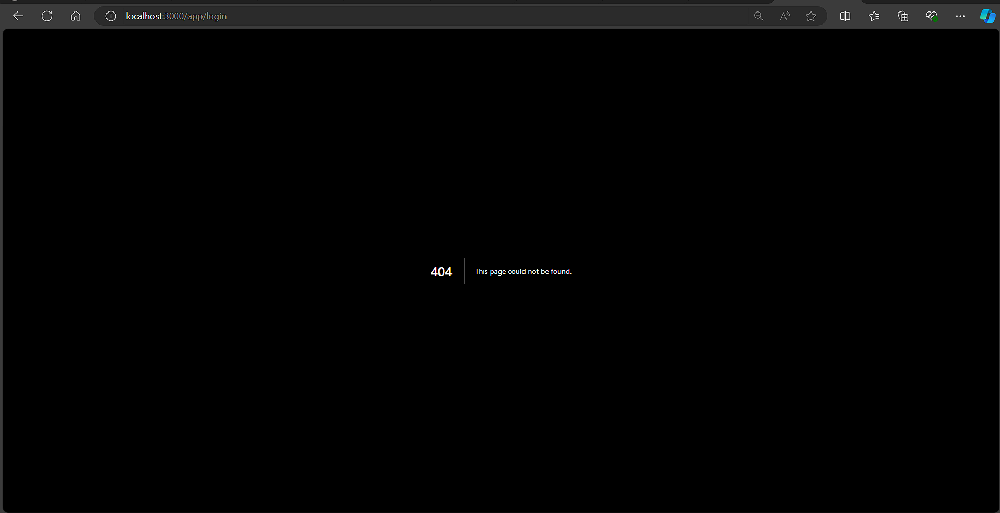

|  | Pemrograman Berbasis Framework 2024 |
|--|--|
| NIM |  2341728026|
| Nama |  Anwar Alif Katresna |
| Kelas | TI - 3A 

  
Hal yang dipelajari: Cara menautkan akun github dengan vercel dan cara mendeploy projek di vercel

  

Hal yang dipelajari: Cara membuat database pada vercel

  

 

 

Fungsi tersebut melakukan queri dan mengubahnya dari struktur data menjadi nilai numerik, sehingga nilai tersebut bisa digunakan pada variabel const numberOfInvoices,numberOfCustomers,totalPaidInvoices,totalPendingInvoices.

 

 

 

# W10 Praktikum 1: Membuat route login

Pada praktikum ini, Anda dapat melanjutkan project dari Codelab #09 sebelumnya.

## Soal 1
#### Coba running di localhost, capture hasilnya dan buatlah laporan di README.md. Jelaskan apa yang telah Anda pelajari dan bagaimana tampilannya saat ini? Apakah ada error ?

- Membuat halaman login khusus dengan menggunakan JSX di file `/app/login/page.tsx`. Halaman ini mencakup formulir login dan logo Acme kemudian menginstal NextAuth.js untuk menangani otentikasi dalam aplikasi Anda dengan menjalankan perintah `npm i --save next-auth@beta`.
Membuat key rahasia untuk enkripsi cookie sesi pengguna dengan perintah `openssl rand -base64 32` dan menyimpannya di file `.env` lalu menambahkan logika middleware untuk melindungi rute tertentu, memeriksa apakah pengguna telah masuk sebelum memberikan akses. Menyiapkan `hash` kata sandi menggunakan bcrypt di file auth.ts. Menambahkan provider Credentials untuk memungkinkan masuk dengan nama pengguna dan kata sandi. Menambahkan fungsi sign in untuk menangani logika otentikasi, termasuk validasi email dan kata sandi.

- Terjadi error pada form login karena belum ada file yang diimpor untuk LoginForm dan AcmeLogo.

## Soal 2
#### Capture hasil form login yang telah dibuat dan buatlah laporan di README.md.

- Dalam praktikum ini, mengimplementasikan tampilan form login dan fungsi sign in sesuai dengan langkah-langkah yang diberikan. Form login ini mencakup input email dan password, tombol login, serta pesan error yang muncul jika login gagal. Form ini juga menggunakan useFormState dan useFormStatus untuk menangani state dan aksi pada form. 
---

## Soal 3
#### Silakan save semua dan lakukan running di browser Anda. Capture hasilnya dan buatlah laporan di README.md.

1. Apakah ada error atau fitur yang belum berfungsi ? jika belum, silakan perbaiki!
- Terdapat beberapa error,namun sudah saya fix dan berfungsi dengan baik.

2. Apakah ketika mengakses path URL root ( / ) dialihkan ke halaman login ? jika belum, silakan perbaiki!
- Pada awalnya belum dialihkan, namun sudah saya alihkan ke halaman login.